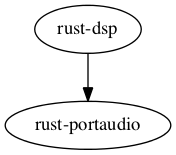

# rust-dsp 

A library for sound Digital Signal Processing, written in Rust.
See examples for usage.

Maintainer: @mitchmindtree

[How to contribute](https://github.com/PistonDevelopers/piston/blob/master/CONTRIBUTING.md)

## Dependency

- [PortAudio] (http://www.portaudio.com/download.html) and the [PortAudio bindings for Rust] (https://github.com/JeremyLetang/rust-portaudio).

## Goals

- A generic synthesis engine offering both additive and FM synthesis tools.
- A powerful sampler with granular synthesis capabilities.
- To create a large collection of effects (including reverberation, delay-lines, spatial processing).
- To bring all of the above together with an easy-to-use signal chain.
- A simple event system for high-level playback.

